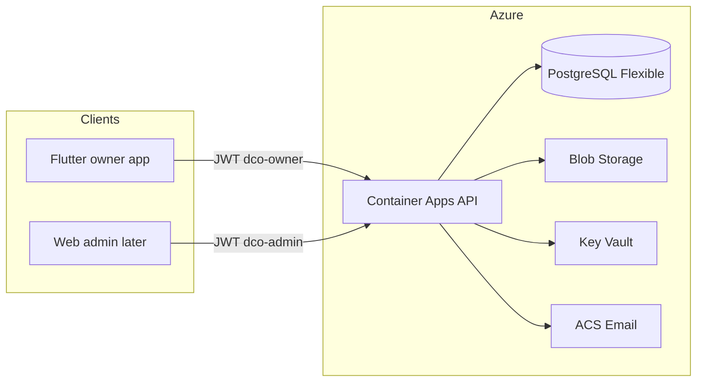

# DCO Phase 1 backend on Azure

Grilling settled this contract. Confirm it before implementation:

- **Product:** honor [product/mvp-scope.md](product/mvp-scope.md). Owner mobile + staff admin API only. No Family sharing, Fleet Portal, dealer portal, or partner logins.
- **IAM:** write [architecture/iam.md](architecture/iam.md) + a backend-stack ADR. No unused org tables, no dormant `org_id` columns.
- **Azure:** Container Apps + PostgreSQL Flexible Server + Blob + Key Vault + ACS email. Local Docker Compose. No APIM, AKS, or Entra External ID.
- **Stack:** Fastify + Drizzle + PostgreSQL. Contract-first against [architecture/openapi.yaml](architecture/openapi.yaml).
- **IaC:** Bicep + `azd` (`azure.yaml` at repo root). Deployable, not deployed.
- **Contract gap:** extend OpenAPI (and implement) **parts**, **fuel types**, and **fuel logs**.

## IAM taxonomy (docs only)

This is the future map, not runtime behavior. Today remains `users.role` = `owner` | `admin`, vehicles owned by `user_id`, partners as records that cannot sign in ([architecture/data-model.md](architecture/data-model.md)).

- **Primary owner** — current MVP. Personal garage, 1–3 cars, `aud=dco-owner`, Flutter. Freemium `plan` stays on the user.
- **Family owner** — later. Same Flutter app and `dco-owner` audience. New `organizations` (type `family`) + memberships + per-vehicle grants. Do not introduce this by making every user a 1-person org now (that would rewrite sync, which is `user_id`-scoped).
- **Fleet operator** — later. Web Fleet Portal, new audience `dco-fleet`, org type `fleet`, roles such as org admin / dispatcher / driver.
- **Dealership** — later. Same org + portal model as fleet (`type=dealership`), not a separate product.
- **Workshop / insurer** — MVP: [partners](architecture/data-model.md) rows (`workshop` | `insurer`, onboarding status). Later: partner tenants with `dco-workshop` / `dco-insurer`. Verified does not unlock booking or claims.
- **Platform admin** — MVP: `aud=dco-admin`, `/v1/admin/*`, seeded out of band.

B2B SaaS (Insurance / Workshop / Analytics portals) stays post-MVP. Fleet Portal is **documented** as the first B2B follow-on, not built here.

## Target topology

Local: Docker Compose (API + Postgres + Azurite or filesystem media driver). `MEDIA_DRIVER=local` as already drafted in [docs/environment-secrets.md](docs/environment-secrets.md).

## What to implement

Scaffold `backend/` (empty today) as the Fastify app. Repo-root `azure.yaml` + `infra/` for azd, matching the existing monorepo (`mobile/`, `architecture/`, `product/`).

**API:** all current `/v1` paths in [architecture/openapi.yaml](architecture/openapi.yaml), plus the missing owner resources:

- `GET/POST /vehicles/{id}/parts`, `PATCH /parts/{id}` (no delete in this slice per [product/frd/parts.md](product/frd/parts.md))
- Fuel Types catalog on the user; `GET/POST /vehicles/{id}/fuel-logs` (no delete per [product/frd/fuel.md](product/frd/fuel.md))
- Sync `entity_type` enum: add `part`, `fuel_type`, `fuel_log` to match the ERD
- Unauthenticated `GET /health` (and `/ready`) for Container Apps probes — not in OpenAPI today

Enforce existing rules server-side: plate unique per account, VIN globally unique, mileage never decreases, archive-not-delete, client UUIDs idempotent, owner vs admin audiences, short-lived signed media URLs (store `blob_key`, never vendor URLs).

**Auth:** email/password JWT as specified in [architecture/system.md](architecture/system.md). Local env logs verification/reset links to stdout; Azure uses ACS. Seed first admin from `BOOTSTRAP_ADMIN_*`.

**Not in this slice:** `web/` admin UI, Flutter changes, live `azd up`, push send, OCR, family/fleet product APIs.

## Docs to land with the code

- [architecture/iam.md](architecture/iam.md) — taxonomy above, extension plan (orgs later), what MVP must not encode
- `docs/adr/backend-stack.md` — Fastify + Drizzle + Postgres (closes the open ADR in [docs/implementation-readiness.md](docs/implementation-readiness.md))
- `docs/adr/azure-hosting.md` — Container Apps instead of the VPS sketch
- Retarget [architecture/system.md](architecture/system.md), [docs/environment-secrets.md](docs/environment-secrets.md), [CLAUDE.md](CLAUDE.md): drop “Azure VPS later”; keep JWT/media/sync rules
- Fix the contradiction in [architecture/system.md](architecture/system.md) that says fuel/charge logs are out of MVP — [product/mvp-scope.md](product/mvp-scope.md) says they are in

## Azure prepare (on execute)

Plan mode cannot write files yet. First implementation action: write `.azure/deployment-plan.md` (azure-prepare requires this name), then generate:

- `azure.yaml` — one `containerapp` service pointing at `backend/`
- `infra/` Bicep: Container Apps Environment, Container App (external ingress, min 1 replica), ACR, PostgreSQL Flexible, Storage account + private container, Key Vault, ACS Email, Log Analytics, App Insights, user-assigned managed identity
- `backend/Dockerfile` (Node 22, production)
- Secrets via Key Vault references: `DATABASE_URL`, JWT secrets, mail, blob
- No APIM / Front Door / Entra External ID

`azd up` is out of this slice unless you later provide subscription + region.

## Build order

1. Docs + ADRs + OpenAPI extensions
2. Fastify scaffold, config, Drizzle schema from the ERD, migrations, health
3. Auth + `/me` + refresh rotation
4. Vehicles + dashboard
5. Change-log + `/sync/push` + `/sync/changes` (every later resource writes the log)
6. Maintenance, parts, fuel, documents, expenses, media, notifications
7. Admin users + partners + audit_events
8. Compose, Dockerfile, Bicep/azd, contract tests against the yaml

Tests: Vitest + Fastify inject. Domain tests for mileage monotonicity, plate/VIN uniqueness, idempotent creates, archive-wins, admin role gate.
