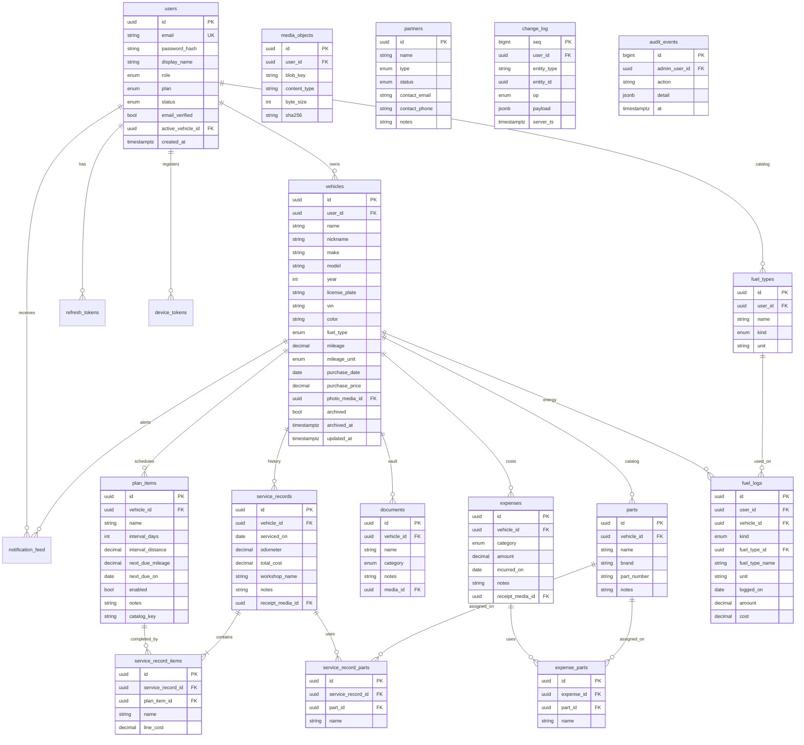

# Data model / ERD (MVP)

**Status:** Proposed. Honor `product/mvp-scope.md` business rules.  
**Compare target:** Autozis demo + public feature list (`https://autozis.com/`, `/app/dashboard`, `/app/garage`, `/app/expenses`).

Client IDs are UUID v4 generated on device so retries are idempotent. Server `user.id` and `plan` are authoritative.

---

## Canonical ERD

Local-only (mobile, not a server table): **outbox** rows (`entity_type`, `entity_id`, `op`, `payload`, `client_ts`, `attempt_count`). Server equivalent is `change_log` plus ordinary CRUD.

---

## Tables and rules

### users

| Field | Rule |
|-------|------|
| `email` | Unique, stored lowercase, max 254 |
| `role` | `owner` (default on signup) or `admin` (granted by an existing admin / seed) |
| `plan` | `free` \| `premium`. Billing off. Free → one non-archived vehicle when gating is later enforced; field must exist now |
| `status` | `active` \| `deactivated`. Deactivated cannot sign in |
| `active_vehicle_id` | Null only when the garage is empty. After the first vehicle, always one active vehicle |
| `email_verified` | Prompt until true; does not block adding a vehicle |

### vehicles

| Field | Rule |
|-------|------|
| `license_plate` | Required, max 20, **unique per `user_id`** among non-archived rows |
| `vin` | Optional; if set, exactly 17 chars; **globally unique** among non-archived vehicles |
| `fuel_type` | Required: `petrol` \| `electric` \| `hybrid_plugin` |
| `year` | 1900 … current year + 1 |
| `mileage` | Required, ≥ 0. **Must not decrease** (higher value wins on sync) |
| `archived` | Soft-delete. Child rows stay; they disappear from owner lists with the vehicle |

Suggested maintenance catalog is **not** a table of user data. It is seed/config keyed by `fuel_type` (see Garage / Maintenance FRDs). Copying a suggestion into `plan_items` stores `catalog_key` for analytics; the row is then user-owned.

### plan_items / service_records

- A plan item needs a time interval, a distance interval, or both.
- Service odometer ≥ vehicle mileage; if greater, bump `vehicles.mileage`.
- Completing a service may clear matching plan dues and set the next due from intervals.
- Line items optional `plan_item_id`. Total cost ≥ 0; may override the sum of lines.

### documents / expenses

- One primary file per document (`media_objects`).
- Document categories: `insurance` \| `registration` \| `invoice` \| `warranty` \| `receipt` \| `other`.
- Expense categories: `fuel` \| `maintenance` \| `insurance` \| `parking` \| `tolls` \| `parts` \| `other`.
- Expense `fuel` is **money only** (no litres, no kWh). Volume and kWh live on `fuel_logs`. Expense `maintenance` does **not** auto-create from service records. Dashboard totals read **expenses only**.
- Assigned parts on an expense snapshot `name` on `expense_parts` so later catalog edits do not rewrite history.

### fuel_types / fuel_logs

- `fuel_types.kind`: `liquid` \| `electric`. Unique `name` per `user_id` (case-insensitive).
- `fuel_logs.kind`: `refuel` \| `charge`. Petrol and hybrid plugin vehicles write `refuel`; electric vehicles write `charge`.
- Amount is litres/gallons or kWh from the catalog type's `unit`. Name and unit are snapshotted on the log.
- Do not copy Autozis odometer-on-log, partial/full tank, or efficiency KPIs.

### change_log

- Append-only. Cursor is opaque (`seq` encoded, not invented by clients).
- Entity types in MVP: `user`, `vehicle`, `plan_item`, `service_record`, `document`, `expense`, `notification`, `media`, `part`, `fuel_type`, `fuel_log`.
- Duplicate create with the same client UUID → idempotent success.
- Archive vs later edit: **archive wins**.

### partners / audit_events

- Partner types: `workshop` \| `insurer`. Status: `draft` \| `pending_verification` \| `verified` \| `rejected`.
- Partners cannot sign in. `verified` does not unlock booking.
- Every admin write gets an `audit_events` row.

---

## Mileage monotonicity

1. Create vehicle: mileage required.
2. Edit vehicle mileage or log a service odometer: reject if new value < stored mileage (`409` / validation error). Admin correction workflow is **out of MVP**.
3. Sync conflict: `max(local, remote)` wins. Never apply a remote mileage lower than local.
4. Dashboard and garage cards display the stored mileage, not a trip log (no trips table).

---

## Archive rules

| Action | Effect |
|--------|--------|
| Archive vehicle | `archived=true`, `archived_at` set. Cancel local notifications. Hide from garage and dashboard switcher. Keep all child rows. |
| Un-archive | Not in MVP UI. Do not resurrect from an older outbox edit if archive already applied. |
| Delete document / expense | Hard-delete that row + queue remote delete + delete media. Not the same as vehicle archive. |
| Delete user | **Forbidden** in MVP. Deactivate instead. |
| Logout | Tokens discarded. Outbox remains encrypted, bound to `user_id`. |

---

## Comparison with Autozis

Observed in the Autozis demo (Toyota Camry dashboard, multi-vehicle garage, expenses form) and [features](https://autozis.com/features):

| Autozis | DCO MVP | Decision |
|---------|---------|----------|
| Multi-vehicle garage, photo, make/model, mileage, purchase date | Same core + plate uniqueness, VIN rule, fuel type enum, nickname, archive | **Adopt** (with DCO rules) |
| Dashboard: vehicle health, mileage, next event, cost KPIs, needs-attention, recent activity | Dashboard for **active vehicle**: identity, ownership summary (spend + counts), 3 maintenance rows, next plan item | **Adopt shape, shrink metrics** — no refuel €, L/100km, insurance expiry module |
| Maintenance plan + reminders (time and/or mileage) + service history | Same | **Adopt** |
| Refuel / charge logs (date, type, amount, cost) | `fuel_types` catalog + `fuel_logs` | **Adopt simplified** — no efficiency KPIs |
| Insurance **tracker** (policy, renew, expiry) | Document category + expense category | **Defer** policy object |
| Trips / mileage logbook | Mileage on vehicle + service odometer only | **Defer** |
| Notes, catalogs (expense types, locations) as first-class screens | Fuel Types catalog only; other catalogs deferred | **Adopt Fuel Types**; defer the rest |
| Parts catalog (name, brand, number) assigned on service / expense | Per-vehicle parts + service assignment | **Adopt** (expense assignment with the expenses form) |
| Documents with multiple attachments, notes | One file per document | **Adopt simplified** |
| Receipt scanning / OCR ("Load from Receipt") | Attach photo, no extract | **Defer** |
| Vehicle sharing, import/export, PDF reports, AI assistant | — | **Defer** |
| Online web owner app, instant sync | Flutter offline-first + change log | **Different architecture** (intentional) |
| No staff admin | Users + partners + audit | **DCO-only** |
| Freemium (advanced features gated) | `plan` field, gating not activated | **Adopt field only** |

Do not add Autozis tables (`trips`, `policies`, `notes`, `expense_types`) to this schema. Fuel logs are a DCO slice (`fuel_types`, `fuel_logs`), not Autozis efficiency tracking.

---

## Freemium field

`users.plan` is `free` or `premium`. MVP does not enforce the one-vehicle cap in UI copy beyond Settings ("Free Plan · 1/1 vehicles" on tldraw screen 9). API may return `vehicle_limit` on `GET /v1/me` so clients can hide "Register another vehicle" later without a schema break.
