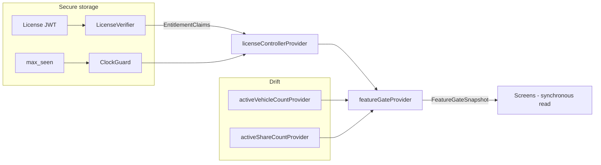

# Offline feature gating (tiered plans)

**Status:** Proposed.
**Contract:** `docs/pricing.md` (tier matrix, limits, error contract). Server remains authoritative per `product/production-scope.md`.
**Scope:** Mobile (Flutter) owner surface + backend. Fleet/Pro stays an org/enterprise entitlement — see §4.

---

## 1. Problem

`docs/pricing.md` defines four tiers (Free / Lite / Standard / Fleet) with hard limits on vehicles, sharing invites, and storage, plus feature flags. The running system has none of this:

- `planEnum ('free','premium')` hardcoded at `backend/src/db/schema.ts:20`, `backend/src/lib/crypto.ts:10`, `backend/src/modules/admin.ts` (432/486/558), `backend/src/lib/bootstrap.ts:20`
- Only sharing invites are enforced (`vehicle-shares.ts:83-101`); `vehicle_limit` is advisory (`openapi.yaml:2860`)
- No `plans` / `subscriptions` / `usage_counters` tables, no billing code
- Mobile parses `User.vehicleLimit` and `Entitlements` but **nothing consumes them**; no client-side JWT parsing exists at all
- `mobile/AGENTS.md:150` currently forbids paywalls (monetization off) — must be updated as part of delivery

The app is offline-first. A user who bought Standard must keep Standard without network; a user who must not have Standard must not be able to grant it to themselves by editing local storage.

## 2. Threat model

| In scope | Out of scope |
|----------|--------------|
| Editing local Drift DB / KV to raise tier or limits | Repackaged/patched APK (binary tampering) |
| Casual tinkering with stored entitlement flags | Rooted-device key extraction |
| Device clock manipulation while offline | Anything requiring server cooperation to defeat |

**Principle:** local gating hides entry points and gives honest offline UX; the **server check is the contract**. This matches `production-scope.md` ("Backend authorization is authoritative"). Defeating the local gate yields nothing durable because sync/push rejects over-limit writes (§9).

## 3. Decisions (grilling session, 2026-10-08)

| # | Question | Decision |
|---|----------|----------|
| 1 | Tier model | Adopt `docs/pricing.md` 4 tiers; full migration of enum, JWT, admin, openapi, AGENTS.md |
| 2 | Threat model | Casual + DB editors; no app attestation; server authoritative |
| 3 | Offline window | `period_end` + 7d grace; rollback → clamp to max-seen-time; degrade to Free, never lock out |
| 4 | Local enforcement scope | Vehicles, share invites, feature flags only — storage/AI/Fleet stay server-side |
| 5 | Existing `premium` users | Plain map → `standard` (no $0 comp / grandfathering) |
| 6 | Token payload | Full claims in token — no local plan matrix, price changes need no app release |
| 7 | Over-limit data | Read/edit existing, block new creates — no data loss ever |
| 8 | Server checks | Land in this PR series (not deferred to payments) |
| 9 | Signing | **Ed25519 + `kid` keyring.** Never HS256 — an HMAC key embedded in the binary is extractable and would let anyone forge licenses |
| 10 | Failure mode | Invalid/garbage license → evaluate as **Free**; valid signature + unknown `plan_id` → trust claims (self-contained) |
| 11 | Storage | License + max-seen-time in Keychain/Keystore (`flutter_secure_storage`) |
| 12 | Fleet on mobile | Mobile gates owner tiers only; fleet entry stays org/enterprise-gated (`canUseFleet`) |
| 13 | Delivery | 4 sequenced PRs (§10) |
| 14 | License refresh | Foreground-if-stale (>24h old or <48h to expiry) + auth refresh + payment events; never blocks startup |
| 15 | Gate API shape | Reactive snapshot: in-memory license + Drift `watch` counts folded into one synchronous read |
| 16 | Counting | Active-only: non-archived vehicles, non-revoked shares (revoke returns the slot — `pricing.md:115`) |

## 4. Tier model & migration

- `planEnum` → `('free','lite','standard','fleet')` via `backend/drizzle/0011_plan_tiers.sql`; data migration `UPDATE users SET plan = 'standard' WHERE plan = 'premium'`
- `plans` reference table from `pricing.md:171` DDL; single source for limits (dedupes `SHARE_LIMITS` in `entitlements.ts:7` **and** `me.ts:12`)
- JWT access claim `plan` carries the new tier; admin plan-change endpoints accept the 4 values; bootstrap admin → `standard`
- `openapi.yaml` `Plan` enum and `Session.plan` parsing updated; `mobile/AGENTS.md:150` paywall prohibition replaced with a pointer to this doc
- **Mobile sells/gates Free/Lite/Standard only** (`pricing.md:151`). `fleet` on mobile is never a purchasable license tier — fleet features remain gated by organization `plan=enterprise` via the existing `GET /v1/me/entitlements` path (`entitlements.dart`, `app_drawer.dart:18`)
- After migration, `premium` no longer exists anywhere. Old premium users silently gain Standard's unlimited sharing (was 5/20) — accepted in decision 5

## 5. Signed license token

### 5.1 Issuance

```
GET /v1/me/license  →  { "license": "<JWT>" }
Authorization: Bearer <access token>
```

```ts
// backend — jose, EdDSA private key lives only server-side (Key Vault / env)
const license = await new SignJWT({
  plan_id: plan.id,                    // 'free' | 'lite' | 'standard' | 'fleet'
  vehicle_limit: plan.vehicleLimit,    // number | null (null = unlimited)
  sharing_limit: plan.sharingLimit,    // number | null
  storage_bytes: plan.storageBytes,
  ai_tier: plan.aiTier,
  features: plan.features,             // { pdf, receipt_scan, import_general, api_access, ... }
  period_end: sub.currentPeriodEnd.toISOString(),
})
  .setProtectedHeader({ alg: 'EdDSA', kid: env.LICENSE_KID })
  .setSubject(userId).setIssuer('dco').setIssuedAt()
  .setExpirationTime(sub.currentPeriodEnd.getTime() / 1000 + 7 * 86400) // +7d grace
  .sign(await importPrivateKey(env.LICENSE_ED25519_KEY));
```

| Claim | Meaning |
|-------|---------|
| `plan_id` | Tier name; unknown-but-valid values are trusted because all limits below are self-contained |
| `vehicle_limit` / `sharing_limit` | `null` = unlimited; used for all local count checks |
| `storage_bytes`, `ai_tier` | Informational on-device (server enforces both) |
| `features` | Boolean flags for entry-point hiding (PDF, receipt scan, import level, API) |
| `period_end` | Billing period end — display only ("renews at…") |
| `exp` | **`period_end` + 7d grace, baked server-side** — client cannot extend the grace |

Free tier: license is issued too, with `vehicle_limit: 1` etc. and a far-future `exp` (or no expiry check for `plan_id: free`).

### 5.2 Verification (client, offline)

1. `alg === 'EdDSA'`, `kid` present in the **bundled keyring** (`kid` → 32-byte Ed25519 public key)
2. Verify signature over `ascii(header + '.' + payload)` **before** parsing claims
3. `trustedNow() <= exp` (§6), else evaluate as Free
4. Any failure (bad signature, unknown `kid`, malformed token) → **Free** (decision 10). Never throw, never block app start

Key rotation: app ships a keyring list, not one key. Activate a new `kid` only after a build containing its public key has been out long enough (grace: keep the old `kid` trusted ≥30d).

### 5.3 Refresh cadence

| Trigger | Behavior |
|---------|----------|
| App cold start | Read cached license from secure storage; verify; gate is usable **before** any network |
| Foreground, stale (>24h old or <48h to `exp`) and online | `GET /v1/me/license`, replace cache |
| After auth refresh | Re-fetch if stale; use access-JWT `iat` as a trusted clock anchor (§6.3) |
| After payment/plan change event | Immediate re-fetch so upgrades show up fast |
| Offline | Network calls skipped silently; cached license continues to apply |

Startup never awaits the network. The license fetch is fire-and-forget behind the cached state.

## 6. Offline clock-tampering protection

### 6.1 Mechanism: max-seen-time

A `max_seen` timestamp (ISO-8601) is persisted **in secure storage next to the license** — not in Drift, so a DB editor cannot roll it back together with the clock.

```dart
Future<DateTime> trustedNow() async {
  final device = _clock.now();
  final seen = await _readMaxSeen();
  if (seen == null) { await _writeMaxSeen(device); return device; }
  // Rollback detected (beyond tolerance): freeze time at last trusted value.
  if (device.isBefore(seen.subtract(_rollbackTolerance))) return seen;
  // Normal operation: trust and advance.
  if (device.isAfter(seen)) await _writeMaxSeen(device);
  return device;
}
```

`_rollbackTolerance = 5 minutes` — absorbs NTP corrections and timezone jitter without punishing the user.

### 6.2 Scenario table

| Scenario | Result |
|----------|--------|
| Clock rolled back 1 year, license valid | Effective time freezes at `maxSeen`; license neither expires nor extends; next online contact re-anchors and the server decides |
| Clock rolled forward to 2050 | `maxSeen` advances → `exp` passes → **degrade to Free** (self-harm) |
| Legit long offline period | Clock runs normally; access until `period_end + 7d`, then Free |
| License tampered/invalid | Free regardless of clock |
| Detected rollback → user still offline for weeks | Frozen time = residual access window until online; **accepted** under the "casual" threat bar (decision 2) |

Degradation is always **to Free, never a lockout** — the app keeps working; the user recovers by going online (server reissues a fresh license).

### 6.3 Trusted upward time anchors

`maxSeen` also advances from server-attested times, which keeps it honest even if the device clock was wrong:

- License `iat` on every successful issuance
- Access-JWT `iat` on every token refresh (already happens ≥ every 15 min of online use)

## 7. Local storage

| What | Where | Why |
|------|-------|-----|
| Signed license JWT | `flutter_secure_storage` key `dco.license` | Not reachable by DB editors; Keychain/Keystore backed |
| `max_seen` timestamp | `flutter_secure_storage` key `dco.license.max_seen` | Must not be rollback-able via Drift |
| Public keyring | Bundled app asset (`assets/license_keys.json`) | Rotation without code change |
| Vehicle/share **counts** | Drift (existing tables) | Reactive, source of truth for counts |
| Fleet entitlements | `AppMeta fleet:<uid>.entitlements` (existing) | Server-driven org gate, unchanged |

**Negative rule:** no tier, limit, or license field is ever written to Drift or `AppMeta`. Entitlements live in exactly one local place.

Hydration: secure-storage read is async. Until it completes, `featureGateProvider` returns `null` (loading) — UI denies creates and shows no premium chrome. Typical cost: milliseconds.

## 8. FeatureGate (mobile)

### 8.1 Shape



License claims are in memory after init; counts come from Drift `watch` streams. `featureGateProvider` folds them into one immutable `FeatureGateSnapshot` that screens read synchronously (`ref.watch(featureGateProvider)?.canCreateVehicle ?? false` — `null` means hydrating, deny by default).

### 8.2 Core types (representative)

```dart
@immutable
class EntitlementClaims {
  final String planId;          // 'free' | 'lite' | 'standard' | 'fleet'
  final int? vehicleLimit;      // null = unlimited
  final int? sharingLimit;
  final int storageBytes;
  final String aiTier;
  final Map<String, bool> features;
  final DateTime periodEnd;
  final DateTime issuedAt;
  final DateTime expiresAt;     // periodEnd + 7d, server-baked

  static const free = EntitlementClaims(planId: 'free', vehicleLimit: 1, ...);
}

@immutable
class FeatureGateSnapshot {
  final EntitlementClaims claims;
  final int vehicleCount;       // active (non-archived)
  final int activeShareCount;   // non-revoked

  bool get canCreateVehicle =>
      claims.vehicleLimit == null || vehicleCount < claims.vehicleLimit!;
  bool get canCreateShare =>
      claims.sharingLimit == null || activeShareCount < claims.sharingLimit!;
  bool feature(String key) => claims.features[key] ?? false;
  LimitResult get vehicleLimitResult;  // feeds the 403-style upsell copy
}
```

Counts mirror existing semantics: vehicles match `_countGarage` (`vehicle_repository_impl.dart:351`, `userId` + `!archived`); shares exclude `revoked | declined | expired`.

### 8.3 Enforcement points (interactive creates)

| Action | Check |
|--------|-------|
| Add vehicle | `canCreateVehicle` → block with upsell sheet (`LIMIT_EXCEEDED` copy from `pricing.md:227`) |
| Start share invite | `canCreateShare` |
| Fleet drawer entry | unchanged — `canUseFleet` from org entitlements (decision 12) |
| Feature-flag entry points (PDF, receipts, import level) | `feature(key)` |

Archiving a vehicle frees a slot; revoking a share frees a slot. Existing over-limit rows remain fully visible and editable; only **new creates** are blocked (decision 7).

## 9. Server enforcement & sync contract

Local gating is UX; every write path is checked server-side in this series (decision 8):

- `POST /v1/vehicles` gains a count check (today: none); share checks already exist
- Limits read from the `plans` table — one source, not per-module constants
- Error contract per `pricing.md:227`:

```json
{ "error": "LIMIT_EXCEEDED", "metric": "vehicles", "current": 1, "limit": 1,
  "upgrade_url": "/pricing", "message": "Free plan allows 1 vehicle. Upgrade to Lite for 3 vehicles." }
```

### Outbox behavior on `LIMIT_EXCEEDED`

Race: user creates vehicles offline on Standard, downgrades, then syncs. Push gets `403 LIMIT_EXCEEDED`:

1. The outbox entry is **parked** — status `rejected`, removed from the retry loop (today: batch retries capped at 5, `sync_engine.dart`)
2. Other entities keep syncing — one bad row never blocks the queue
3. Parked rows stay in local Drift (data preserved, decision 7) and surface in the sync screen: *"N changes rejected — upgrade to keep them syncing"*
4. On upgrade, parked rows are eligible for push again

Non-`LIMIT_EXCEEDED` errors keep today's retry behavior.

## 10. Delivery — 4 sequenced PRs

| PR | Contents | Verifiable by |
|----|----------|---------------|
| **1. Backend tier migration** | `plans` table + `0011_plan_tiers.sql`, `planEnum` → 4 tiers, `premium→standard` data migration, JWT claim, admin endpoints, `/me/entitlements` claims, dedupe `SHARE_LIMITS`, openapi `Plan` enum, `mobile/AGENTS.md` + `architecture/iam.md` plan-rule edits | backend vitest suite green |
| **2. License issuance** | Ed25519 keypair + `kid`, `GET /v1/me/license`, openapi path, issuance tests | vitest: sign→verify round-trip, expiry = period_end+7d |
| **3. Server limit checks** | Vehicle create count check, `LIMIT_EXCEEDED` contract, limits centralized in plans module | vitest: 403 at limit, unlimited tier passes |
| **4. Mobile gating** | License store/verifier/clock guard, FeatureGate providers, enforcement at create entry points, outbox park-on-403 + sync UI surfacing | flutter test (§11) |

PR 4 may start in parallel with 2–3 behind the existing `entitlementsProvider` pattern; the license fetch lands when PR 2 is available.

## 11. Testing

| Layer | Cases |
|-------|-------|
| Verifier (unit) | Tampered payload, wrong `kid`, unknown `alg`, expired, future `iat`, unknown-but-valid `plan_id` → trusts claims |
| Clock guard (unit, fake `Clock`) | Rollback freeze + 5-min tolerance, forward jump expires license, `iat` anchors advance `maxSeen` |
| FeatureGate (unit) | Active-only counts, `null` limit = unlimited, hydrating = deny, archive frees slot |
| Backend (vitest) | Issuance round-trip, 403 at limit, unlimited passes, `premium` rows migrated to `standard` |
| Sync (integration) | Outbox parks on `LIMIT_EXCEEDED`, siblings continue, requeue after upgrade |

## 12. Non-goals

Rejected during grilling — do not reintroduce without a new decision:

- SQLCipher / full local DB encryption (data-at-rest is not the threat here)
- Play Integrity / app attestation / root detection
- Local storage-byte metering or local AI-tier enforcement (server-side only)
- Fleet/Pro purchase or evaluation on the mobile owner surface
- Owner-tier gating on web admin or fleet portal
- $0 grandfathering / comp grants for existing premium users

## Related docs

- Pricing matrix, limits, error contract: `docs/pricing.md`
- Server-authoritative rule: `product/production-scope.md`
- IAM taxonomy and plan claims: `architecture/iam.md`
- Entitlements endpoint / OpenAPI: `architecture/openapi.yaml` (`/v1/me/entitlements`)
- Sync engine: `mobile/lib/core/sync/sync_engine.dart`, `docs/mvp-as-built.md`
- Mobile contract: `mobile/AGENTS.md`
