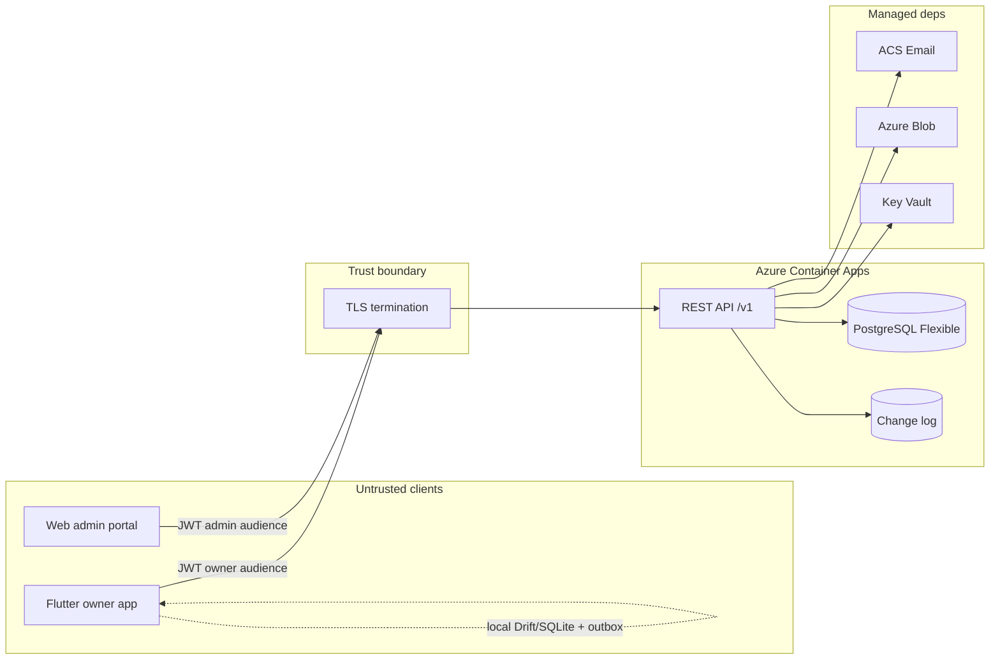

# System architecture (MVP)

**Status:** Proposed — proceed to implement against this document.  
**Contract:** `product/mvp-scope.md` and `product/frd/`.  
**Hosting:** REST API runs on Azure Container Apps (`docs/adr/azure-hosting.md`). Local loop is Docker Compose. See `docs/environment-secrets.md` for the env map. IAM taxonomy: `architecture/iam.md`.

---

## What we are building

Three surfaces share one API and one database:

| Surface | Who | Online? | Stack (decided / not) |
|---------|-----|---------|------------------------|
| **Mobile owner app** | Car owners | Offline-first | Flutter, Riverpod, GoRouter, Drift/SQLite, Dio — decided |
| **REST API** | Serves mobile + admin | Always online | Fastify + Drizzle + PostgreSQL, REST + JWT, versioned `/v1` (`docs/adr/backend-stack.md`) |
| **Web admin portal** | Internal staff | Online-only | Framework ADR still open. Visual tokens from `docs/design-system.md` |

The owner product is a **digital garage**: vehicles, maintenance plan + history, documents, expenses, parts, and refuel/charge **logs**. It is **not** Autozis: fuel *efficiency* KPIs, insurance *policies*, trips, OCR, AI assistant, family sharing, and PDF reports stay out of MVP (`product/mvp-scope.md` Out of Scope). Refuel/charge logs are in Phase 1.



---

## Surfaces and responsibilities

### Mobile (primary)

- Auth screens (online-only until a session exists).
- After login: **Dashboard** for the active vehicle (tldraw screen 3). Bottom nav: Dashboard (Garage), Maintenance, Expenses, Settings.
- All owner writes go to **local SQLite first**, then the sync outbox.
- UI never reads the network as the source of truth. Pull updates the local DB; widgets read local rows.

### Web admin

- Separate route tree and token audience. An owner JWT must not open admin routes.
- Online-only. No Drift, no outbox, no owner Garage/Maintenance/Expenses screens.
- MVP: login, overview counts, user list/profile/support actions, partner records.
- Wireframes: `wireframes/dco-mobile-wireframes.tldraw` frames A1–A6 (WEB ADMIN cluster).

### API

- Versioned REST (`/v1`).
- Enforces business rules that clients can get wrong: plate uniqueness per account, VIN uniqueness, mileage monotonicity, archive-not-delete, plan field, admin role.
- Owns the durable copy of owner data and the change log used by sync.
- Issues and rotates JWTs; sends verification and reset mail; stores media bytes in object storage.

---

## Trust boundaries

| Boundary | Rule |
|----------|------|
| Public internet → API | TLS only. No plaintext. |
| Owner client | Untrusted. Validate every write. Client-generated UUIDs are allowed for idempotency, not for privilege. |
| Admin client | Untrusted in the same way, plus **role `admin` on every `/v1/admin/*` call**. |
| Tokens | Access token short-lived. Refresh token rotated on use, stored in Keychain/Keystore (mobile) or a secure web store (admin). Never log token values. |
| Media | Files are per-vehicle, authorized by the owning user (or admin metadata-only). Do not put long-lived public blob URLs in API JSON; use short-lived signed URLs or authenticated download. |
| PII | Admin user list shows email/name/plan/status, not document bytes (`product/frd/admin.md`). |
| Sync | Outbox on device is bound to `user_id`. After logout, a different account on the same phone must not push the previous outbox. |

Seed the first admin **out of band** (env or SQL), not via owner signup.

---

## Where JWT lives

```text
Signup / login (online)
        │
        ▼
API verifies credentials
        │
        ▼
Access JWT  (minutes, aud=dco-owner or dco-admin, sub=user id, plan, role)
Refresh JWT (days, rotating, family id for revoke-all-on-reset)
        │
        ├── Mobile: both in secure storage; Dio interceptor attaches Bearer access
        └── Admin: access in memory; refresh in httpOnly cookie if the web stack allows, else secure storage
        │
Refresh on 401 once per request cycle
Password reset → revoke all refresh families for that user
```

Auth endpoints themselves are **online-only**. After a session exists, Garage / Maintenance / Documents / Expenses work offline (`product/frd/auth.md`, `product/frd/sync.md`).

---

## Offline vs online

| Capability | Offline | Online |
|------------|---------|--------|
| Owner writes (vehicle, plan, service, expense, document metadata + local file) | Local commit + outbox row | Push then pull |
| Auth signup/login/reset | No | Required |
| Admin portal | No | Required |
| Mileage conflict | Local higher value kept | Server accepts max(local, remote); never decreases |
| Media bytes | Stored on device; queued | Upload after metadata ack; retry bytes without duplicating the record |
| Notifications (due reminders) | Local OS schedule | Feed rows sync; push send is **not** required in MVP |

Sync triggers: cold start after auth, reconnect, debounced local write (~1s), manual retry. Status is informational and must not block navigation.

Full sequence diagram is a **should-have** later (`docs/implementation-readiness.md`). Policy to implement now is in `product/frd/sync.md`.

---

## Media storage

1. Client compresses images before queueing (15 MB cap after compression; PDF as-is under the same cap).
2. Local file path is stored on the document / receipt / vehicle-photo row.
3. Sync uploads bytes to the API (multipart) or to a signed PUT URL. Local uses a disk driver; Azure uses Blob. Resource JSON stores `blob_key`, not a vendor URL.
4. Server stores: `blob_key`, `content_type`, `byte_size`, `sha256`.
5. Download: authenticated GET or short-lived signed URL. Admin does not stream owner files in the default profile view.

Vehicle photos, service receipts, expense receipts, and vault documents share this pipeline. OCR is out of MVP.

---

## Data ownership and archive

- Every owner entity belongs to a `user_id` and (except the user row itself) a `vehicle_id`.
- Archive vehicle = soft-delete. Plan items, services, expenses, and documents stay attached and hidden with the vehicle. They are not hard-deleted.
- Server is authoritative for `user.id` and `plan` (`free` / `premium`). Monetization is off; the field still exists.

---

## Deployment (Azure Container Apps)

IaC lives at repo root (`azure.yaml`, `infra/`). This slice is **deployable**, not deployed.

- Container Apps (external ingress, min 1 replica) running the Fastify image from ACR.
- Azure Database for PostgreSQL Flexible Server.
- Blob for media; ACS Email for verification and password reset.
- Secrets from Key Vault via managed identity. Never in the image or git.
- Local: Docker Compose + Postgres + `MEDIA_DRIVER=local`.

See `docs/adr/azure-hosting.md` and `.azure/deployment-plan.md`.

---

## Mapping to Autozis (reference only)

Autozis demo (`https://autozis.com/app/dashboard`) is an **online owner web app**: sidebar (Garage, Assistant, Maintenance Plan, Insurance, Notes, Documents, Refuel, Expenses, Trips, catalogs) plus a bottom module dock. DCO reuses the *idea* (active vehicle home with health, next event, costs, recent activity) and rejects Autozis modules that MVP deferred. Admin is **not** in Autozis; DCO adds it as a staff portal with the same dark-sidebar + KPI-card chrome.

See `architecture/data-model.md` for entity-level compare and `docs/app-shell.md` for nav compare.

---

## Open decisions (do not block this architecture)

- Web framework (`docs/implementation-readiness.md` Web stack ADR).
- Azure subscription and region (parameters at first `azd up`).

Backend stack and hosting ADRs are accepted: `docs/adr/backend-stack.md`, `docs/adr/azure-hosting.md`.
