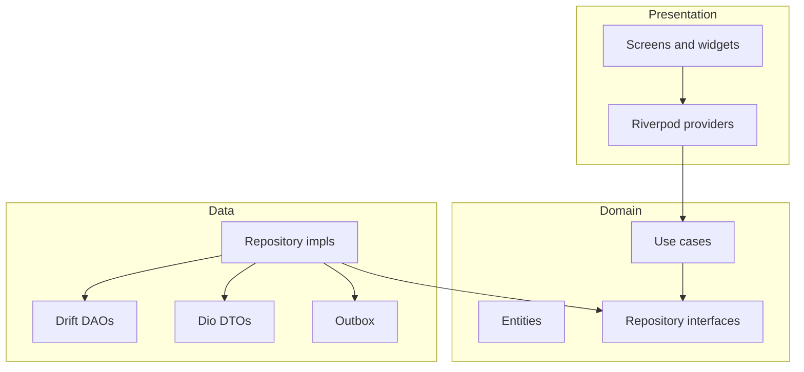

# DCO Mobile — Agent Contract

Working contract for the Flutter **owner app**. Do not copy FRDs into this file. Point at them and honor the rules below.

This is the primary product surface. The web admin portal is a separate app and is **not** implemented here.

**Scaffold status:** Flutter project is in place (`dco_mobile`, iOS + Android). Theme, auth (mock in debug), four-tab shell, local Drift persistence (vehicles + outbox), and register/edit vehicle are implemented. Next: sync engine drain, then maintenance.

---

## Sources of truth

If this file and a source disagree, the source wins and this file must be updated in the same change.

| Concern | Source |
|---------|--------|
| What ships in MVP | [`product/mvp-scope.md`](../product/mvp-scope.md) |
| Feature behavior | [`product/frd/`](../product/frd/) |
| Surfaces, JWT, offline vs online, media | [`architecture/system.md`](../architecture/system.md) |
| Entities, mileage, archive | [`architecture/data-model.md`](../architecture/data-model.md) |
| HTTP shapes | [`architecture/openapi.yaml`](../architecture/openapi.yaml) (index: [`architecture/api.md`](../architecture/api.md)) |
| Navigation IA | [`docs/app-shell.md`](../docs/app-shell.md) |
| Theme rules | [`docs/design-system.md`](../docs/design-system.md) |
| Token values | [`docs/theme/garage-minimal-dark.json`](../docs/theme/garage-minimal-dark.json) |
| Stack | [`docs/technical-principles.md`](../docs/technical-principles.md) |
| Env / secrets | [`docs/environment-secrets.md`](../docs/environment-secrets.md) |
| Build order | [`docs/implementation-readiness.md`](../docs/implementation-readiness.md) |

MVP scope wins over an FRD. If they disagree, update the FRD. OpenAPI wins over FRD prose for HTTP shapes; update both in the same change.

---

## Project overview

Digital Car Ownership (DCO) is a digital garage: vehicles, maintenance plan + history, documents, expenses. Offline-first. Synced to a versioned REST API (`/v1`, audience `dco-owner`).

After a successful owner login, land on **Dashboard** (tldraw screen 3) — the **active vehicle's home**. Bottom nav labels: **Garage / Maintenance / Expenses / Setting**. The Garage tab **is** Dashboard; it is named Garage because the working context is the garage's active vehicle. My Garage (vehicle list) is one tap off the header chip, not a fifth tab.

Documents is reached from Expenses (header) and from vehicle flows — not a tab. Sync status is a compact indicator in the top bar or Settings — never a fifth tab.

**In MVP:** auth (email + password), app shell, Drift/SQLite, sync outbox, dashboard, garage, maintenance, documents, expenses, local reminder notifications.

**Out of MVP (do not add):** fuel/charge logs, volume, MPG/kWh; insurance policy module; receipt OCR; trips; family sharing; Autozis assistant/catalogs/PDF export; admin routes; light theme.

Wireframes: [`wireframes/dco-mobile-wireframes.tldraw`](../wireframes/dco-mobile-wireframes.tldraw). Auth screens live there; do not redesign them.

---

## Technologies (decided)

Debug builds default `DCO_MOCK_AUTH=true` so auth screens work before the API exists. Release builds never mock. Override with `--dart-define=DCO_MOCK_AUTH=false`.

| Role | Choice |
|------|--------|
| UI | Flutter. Material 3 seeded **only** from Garage Minimal Dark. No default purple. |
| State | Riverpod (`flutter_riverpod` + `riverpod_annotation` / `riverpod_generator`) |
| Routing | GoRouter with `StatefulShellRoute` for the four tabs |
| Local DB | Drift / SQLite |
| HTTP | Dio — Bearer interceptor; refresh-on-401 **once** per request cycle |
| Models | Freezed + json_serializable |
| Tokens | `flutter_secure_storage` (Keychain / Keystore) |
| Fonts | `google_fonts`: Barlow (titles), IBM Plex Sans (body), IBM Plex Mono (VIN, plates, amounts) |
| IDs | UUID v4 generated on device (idempotent creates) |
| Connectivity / paths | `connectivity_plus`, `path_provider` |
| Media | `image_picker` + client-side compression (15 MB cap after compression; PDF as-is under the same cap) |
| Reminders | `flutter_local_notifications` |
| Codegen | `build_runner` |

Config via `--dart-define` or flavors — never committed secrets:

- `API_BASE_URL` (per environment)
- `JWT_OWNER_AUD` (must match server; draft `dco-owner`)

Do not put JWT signing keys in the app.

---

## Architecture

Feature-first Clean Architecture. Dependencies point inward: `presentation` → `domain` ← `data`.

Features must not import another feature's `data` or `presentation`. Share through `core/` or domain contracts. Dashboard **composes** garage, maintenance, expenses, and documents; it does not own those tables.



### Layer rules

| Layer | Lives in | May import | Must not import |
|-------|----------|------------|-----------------|
| `domain/` | entities, repository interfaces, use cases | Dart only | Flutter, Dio, Drift, other features |
| `data/` | repository impls, DTOs, mappers, Drift/Dio | domain, `core/` data infra | presentation, other features' presentation |
| `presentation/` | screens, widgets, Riverpod notifiers | domain, `core/widgets`, `core/theme` | Dio/Drift directly; other features' data |

### Data flow (non-negotiable)

1. Widgets read **local Drift only** via a repository / use case. The network is never the UI source of truth.
2. Write: local row → outbox row → UI updates from local.
3. Sync engine (cold start after auth, reconnect, debounce ~1s after local write, manual retry): **push then pull**.
4. Auth (signup / login / reset) is **online-only**. After a session exists, Garage / Maintenance / Documents / Expenses work offline.
5. Sync status is informational and must not block navigation.

### Auth and tokens

- Access JWT (minutes, `aud=dco-owner`) + refresh JWT (days, rotating) in secure storage.
- Dio attaches Bearer access. On 401, refresh once per request cycle, then retry.
- Password reset revokes all refresh families (server). Client discards tokens on logout.
- Logout: tokens discarded. Outbox remains, bound to `user_id`. A different account on the same phone must not push the previous outbox.
- Unauthenticated: only welcome / login / signup / password-reset. Authenticated: those screens are unreachable without logout.

### Sync and conflicts

- Outbox columns: `entity_type`, `entity_id`, `op`, `payload`, `client_ts`, `attempt_count`.
- Mileage conflict: `max(local, remote)` wins. Never decrease mileage.
- Archive vs later edit: **archive wins**.
- Media: compress → store local path on the row → upload bytes after metadata ack; retry bytes without duplicating the record.
- Duplicate create with the same client UUID is idempotent.

### Domain rules the client must honor

- License plate unique per account (non-archived). VIN globally unique when set (17 chars).
- Always one active vehicle once the garage is not empty.
- Archive vehicles (soft-delete). Do not hard-delete vehicles or their child records.
- Fuel type required: `petrol` | `electric` | `hybrid_plugin`.
- Year: 1900 … current year + 1. Plate max 20 chars. Mileage ≥ 0 and monotonic.
- `users.plan` exists (`free` / `premium`). Monetization is off; do not invent a paywall.
- Expense `fuel` is money only (no litres, no kWh). Dashboard totals read **expenses only**, not service-record costs.

---

## Required folder structure

The next `flutter create` pass must produce this tree (plus the usual `android/` / `ios/` / `test/` boilerplate Flutter generates). Feature folders exist even if empty so later slices land in a known place.

```text
mobile/
  AGENTS.md
  pubspec.yaml
  analysis_options.yaml
  lib/
    main.dart
    bootstrap.dart                 # ProviderScope, Drift, Dio, secure storage
    app.dart                       # MaterialApp.router + theme
    core/
      theme/                       # JSON tokens → ColorScheme + ThemeExtension<DcoTokens>
      router/                      # GoRouter, shell, guards
      network/                     # Dio, interceptors, API error mapping
      database/                    # Drift DB, tables, DAOs, outbox table
      storage/                     # secure token store
      sync/                        # push/pull engine, conflict (mileage max wins)
      media/                       # compress, local path, upload queue
      notifications/               # local OS schedule
      widgets/                     # shared: buttons, cards, empty, shimmer, errors
      analytics/                   # MVP events from product/mvp-scope.md
    features/
      auth/
        data/
        domain/
        presentation/
      dashboard/
        data/
        domain/
        presentation/
      garage/
        data/
        domain/
        presentation/
      maintenance/
        data/
        domain/
        presentation/
      documents/
        data/
        domain/
        presentation/
      expenses/
        data/
        domain/
        presentation/
      settings/
        data/
        domain/
        presentation/
      notifications/
        data/
        domain/
        presentation/
  test/
    core/
    features/
  integration_test/
  assets/                          # only if we later self-host fonts; default is google_fonts
```

### What lives where

- **`core/`** — theme, router, Dio, Drift schema, sync engine, media pipeline, local notification scheduler, primitive widgets, analytics. Shared infrastructure, not a dumping ground for feature screens.
- **`features/<name>/domain/`** — entities, repository interfaces, use cases (pure Dart).
- **`features/<name>/data/`** — Drift/Dio implementations, DTOs, mappers.
- **`features/<name>/presentation/`** — screens, widgets, Riverpod notifiers.

Dashboard does not own vehicle / plan / service / expense / document tables. Those belong to their features; dashboard repositories read through those contracts (or `core/database` DAOs exposed via the owning feature).

### Routes

From [`docs/app-shell.md`](../docs/app-shell.md). Keep one `StatefulShellRoute` for the four tabs. Nested screens push on the active tab's stack. Switching tabs does not destroy stacks in MVP.

| Tab (UI) | GoRouter path | Tldraw | Role |
|----------|---------------|--------|------|
| Garage | `/dashboard` | 3 | Home. Active vehicle. Default after login. |
| Maintenance | `/maintenance` | 6 | Plan + history for the active vehicle. |
| Expenses | `/expenses` | 7 | Spend for the active vehicle. |
| Setting | `/settings` | 9 | Account, vehicles, sync. |

Unauthenticated: login / signup / password-reset only.

Push on the active tab (not new tabs): My Garage, Add/Edit Vehicle; Maintenance Plan, Suggested items, Add item, Register Service, Service detail; Add/Edit expense, Expense detail; Document list / viewer / upload; Notification feed, Profile, Email & password, Notification prefs, Sync status.

Empty garage: Dashboard is still the default route. Maintenance, Expenses, and Documents show their "no active vehicle" empty states until a vehicle exists.

---

## Theme and UI rules

Map [`docs/theme/garage-minimal-dark.json`](../docs/theme/garage-minimal-dark.json) 1:1 into `ColorScheme` + `ThemeExtension<DcoTokens>` (status, radius, space). Dark only for MVP.

`ThemeData`:

- `scaffoldBackgroundColor` → `background.primary`
- `cardColor` → `background.card`
- `colorScheme.primary` → `text.accent`
- `colorScheme.onPrimary` → `text.onAccent`
- `colorScheme.error` → `status.danger.fg`
- `navigationBarTheme` icons → `icon.active` / `icon.inactive`

**Gold (`#EEB757`) allowed:** primary button, active icon, focus ring, selected vehicle chip, text links.

**Gold not allowed:** screen backgrounds, overdue badges, chart-only decoration, large hero blocks.

Overdue = `status.danger` / `feedback.overdue`. Due-soon = `status.warning` / `feedback.dueSoon`. Do not convey overdue by color alone — keep the word "Overdue" / an icon.

No one-off hex in widgets. If a screen needs a new color, add it to the JSON and [`docs/design-system.md`](../docs/design-system.md) first.

Tertiary text is for icons and placeholders, not small body copy on cards (use `text.caption`). Hit targets 44×44. Motion 120–180ms; honor reduced motion. Do not substitute Inter / Roboto.

---

## Agent operating rules

1. Honor [`product/mvp-scope.md`](../product/mvp-scope.md) over an FRD if they disagree; then update the FRD.
2. Implement HTTP against [`architecture/openapi.yaml`](../architecture/openapi.yaml).
3. Client UUIDs for creates. Archive vehicles; do not hard-delete them.
4. UI reads Drift. Writes go local + outbox. Do not bind lists to Dio responses.
5. Do not add Autozis modules (refuel logs, trips, insurance policies, OCR, assistant, PDF reports).
6. Do not implement admin portal URLs, admin JWT audience, or partner onboarding in this app.
7. Do not commit secrets. Use `--dart-define` / flavors for `API_BASE_URL` and `JWT_OWNER_AUD`.
8. Keep workflows consistent: same empty / error / loading language across features; design-system tokens only.
9. Domain rules (mileage, VIN, plate, fuel type, archive) get automated tests. Test use cases without Flutter.

### Suggested build order

From [`docs/implementation-readiness.md`](../docs/implementation-readiness.md):

1. Theme tokens (`core/theme`)
2. Auth + app shell (Dashboard as default after login)
3. Garage (active vehicle)
4. Sync outbox on those writes
5. Maintenance → Documents → Expenses
6. Notifications (local)

### Analytics (MVP)

Instrument the critical path only: `auth_signed_up`, `auth_signed_in`, `garage_opened`, `vehicle_added`, `vehicle_deleted`, `vehicle_switched`, `vehicle_updated`, `maintenance_record_added`, `maintenance_reminder_completed`, `document_uploaded`, `expense_added`, `sync_completed`, `sync_failed`.
